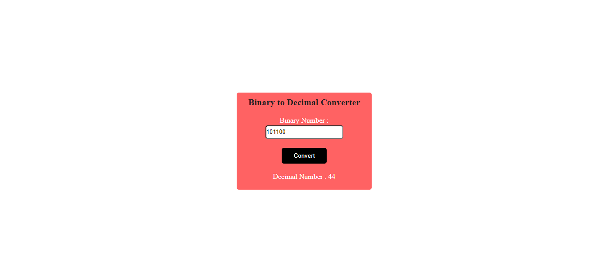
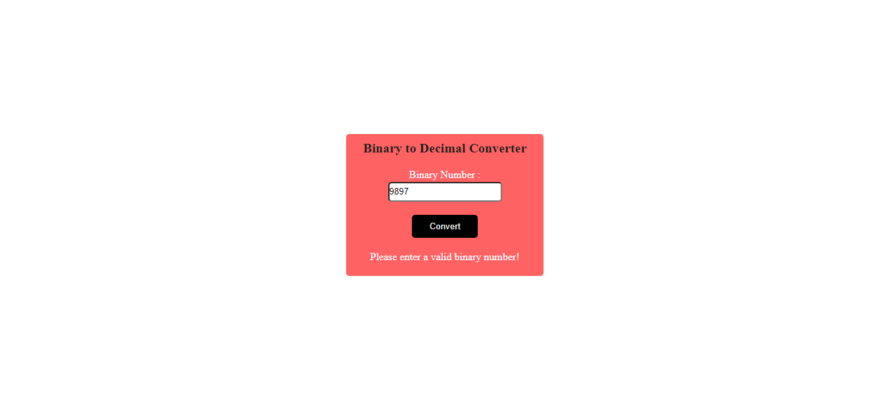

# PRANAV MATHUR

## Learnings from the project:

- Using _preventDefault_ to stop form from refreshing the page
- Using **parseInt(binary, 2)** to get decimal number

## Time taken:

    It took me 4 hours to complete this project.

## Screenshots:

## Live link:

[Go to site](https://09-binary-to-decimal.netlify.app/)
